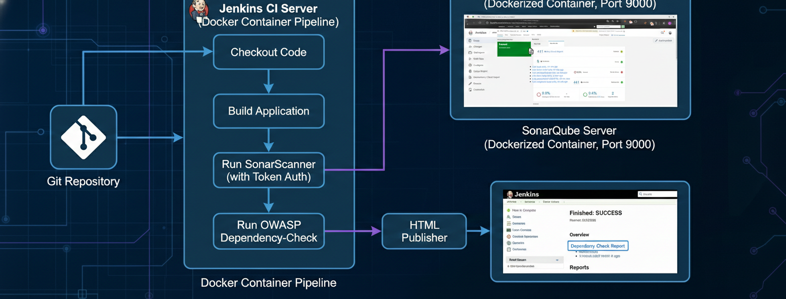
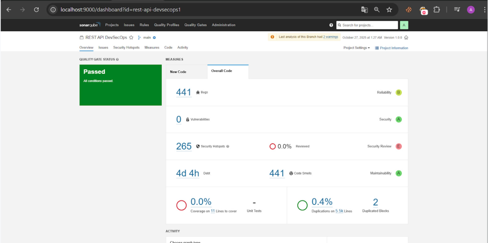
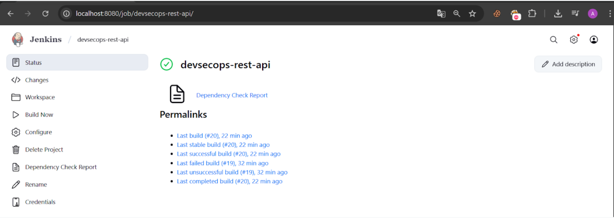

# 🛡️ REST API DevSecOps Pipeline with SonarQube & Jenkins

Proyek ini merupakan implementasi DevSecOps *end-to-end* pada layanan REST API. Fokus utama dari proyek ini adalah melakukan analisis kode dan pemindaian kerentanan secara otomatis menggunakan **SonarQube** yang berjalan di dalam container Docker dan terintegrasi penuh ke dalam pipeline **Jenkins**.

---

## 🏗️ System Workflow (Arsitektur DevSecOps)

*Arsitektur pipeline CI/CD yang mengintegrasikan repositori kode dengan Jenkins, dilanjutkan dengan eksekusi Static Application Security Testing (SAST) via SonarQube dan Software Composition Analysis (SCA) via OWASP.*

---

## ⚙️ Alur Kerja & Konfigurasi (Langkah Eksekusi)

Berikut adalah tahapan integrasi teknis yang dilakukan pada lingkungan *containerized* ini:

1. **Jalankan SonarQube via Docker:** Mengaktifkan container SonarQube menggunakan Docker yang berjalan pada port `9000`.
2. **Autentikasi Aman:** Membuat Token Autentikasi langsung dari dashboard SonarQube (melalui menu `My Account > Security`).
3. **Setup Environment Jenkins:** Menginstal **SonarScanner** di dalam *container* Jenkins agar agen dapat mengeksekusi pemindaian kode secara lokal.
4. **Integrasi Pipeline:** Mengintegrasikan perintah eksekusi `sonar-scanner` ke dalam tahapan pipeline Jenkins menggunakan `Execute Shell`.
5. **Automated Scanning:** Menjalankan pipeline dan memastikan SonarQube Server berhasil menerima hasil analisisnya.

---

## ✅ Checklist Keberhasilan Eksekusi

Infrastruktur dan pipeline ini telah diuji dan memenuhi kriteria kelulusan DevSecOps berikut:

- [x] Container SonarQube aktif (divalidasi dari hasil `docker ps`).
- [x] Token SonarQube berhasil dibuat untuk otentikasi *scanner*.
- [x] Instalasi SonarScanner sukses (divalidasi via terminal di dalam Jenkins container).
- [x] Jenkins job/pipeline berjalan sempurna (menampilkan status **"Finished: SUCCESS"** dan langkah *sonar-scanner* terlihat tereksekusi di *console output*).
- [x] Proyek berhasil tampil dan teranalisis di **SonarQube Dashboard** (`http://localhost:9000/projects`).
- [x] **Report HTML** dari eksekusi *dependency-check* (OWASP) berhasil di-publish dan muncul di antarmuka Jenkins HTML Publisher.

---

## 📊 Bukti Eksekusi (Screenshots)

### 1. SonarQube Dashboard (Quality Gate)
Menampilkan hasil analisis statis menyeluruh termasuk metrik *Bugs*, *Vulnerabilities*, *Security Hotspots*, dan status Quality Gate **Passed**.

### 2. Jenkins Pipeline & HTML Publisher
Menampilkan status build **SUCCESS** pada Jenkins beserta keberhasilan mem-publish laporan *Dependency Check Report* di sidebar.

